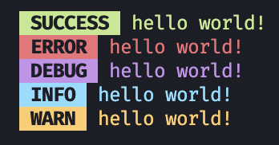
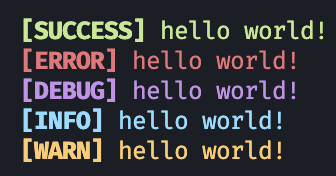

# Spark Logger ⚡️

> A logger built on [TypeScript](https://typescriptlang.org) 

## **Installation**

- To install, run `npm i @spark/logger`.
- Usage:

## **Example Usage**

**TypeScript / ESM**
```ts
import { Logger } from '@spark/logger';

const logger = new Logger();
logger.error('An error occured');
```

**CommonJS**
```ts
const { Logger } = require('@spark/logger');

const logger = new Logger();
logger.error('An error occured');
```

**NOTE:** You can use all of the functions from the regular console, such as `console.log('hello world')` becomes `logger.log('hello world')`

## **Types**

- There are built-in type declarations, the options for `new Logger();` are below:

```ts
new Logger({
  logLevel: 'success' | 'error' | 'warn' | 'debug' | 'info',
  logStyle: 'highlight' | 'bracket',
});
```

## **Images**

**Highlight Style:**



**Bracket Style:**

